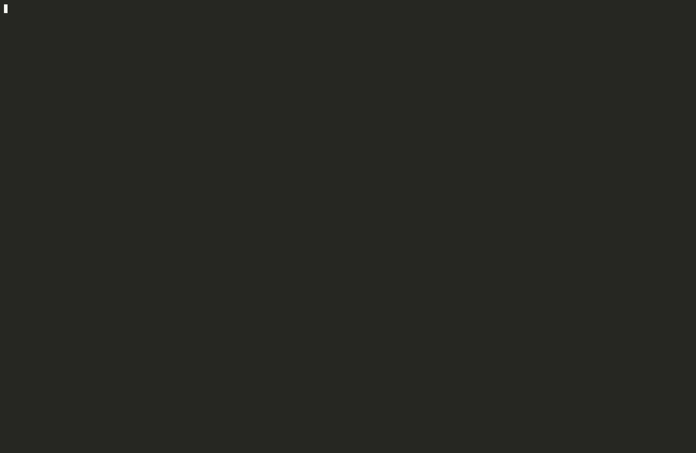

# Telize

**Build reproducible, structured AI workflows with YAML and run them from your terminal, combining LLMs, shell, Python, and more—fully under your control.**

Telize is a low-code framework for building agent-style pipelines: chain shell commands, file I/O, LLM calls, Python functions, and nested flows in a single workflow file. Configuration is validated before execution, and the CLI shows live progress as each step completes.



[CI](https://github.com/telize-ai/telize/actions/workflows/ci.yml) · [Python 3.12+](https://www.python.org/downloads/) · [License](LICENSE)

---

## Table of contents

- [Features](#features)
- [Requirements](#requirements)
- [Installation](#installation)
- [Quick start](#quick-start)
- [Motivation](#motivation)
- [How it works](#how-it-works)
- [Workflow reference](#workflow-reference)
- [Examples](#examples)
- [CLI](#cli)
- [Development](#development)
- [Contributing](#contributing)
- [License](#license)

## Features

- **YAML workflows** — one file defines `config`, named `models`, flows, and steps
- **Composable steps** — `input`, `llm`, `shell`, `python`, `flow`, and `yaml` actions
- **Jinja templating** — wire step outputs together with `{{ steps.name.output }}`
- **Loops and sub-flows** — iterate LLM steps over split lists; call nested flows with `uses: flow`
- **Validated upfront** — Pydantic models catch schema errors before any step runs
- **Rich CLI output** — progress, step panels, and errors in the terminal
- **OpenAI-compatible LLMs** — official OpenAI API or local [Ollama](https://ollama.com/) via the same client

## Requirements

- **Python 3.12+**
- **LLM endpoint** for `uses: llm` steps — [OpenAI](https://platform.openai.com/) or [Ollama](https://ollama.com/); set `api_url` on each model profile (default `http://localhost:11434`)
- Optional: [uv](https://docs.astral.sh/uv/) for fast local development

## Installation

```bash
pip install telize
```

From source:

```bash
git clone https://github.com/telize-ai/telize.git
cd telize
uv sync
uv pip install -e .
```

Check the install:

```bash
telize --version
```

## Quick start

**1.** For local models, start [Ollama](https://ollama.com/) and pull a model:

```bash
ollama pull qwen3.5:4b   # or any model id you set under models.*.model
```

For OpenAI Cloud, set `OPENAI_API_KEY` and point a model profile at the API, for example `api_url: https://api.openai.com/v1`.

**2.** Create `hello.yaml`:

```yaml
config:
  entrypoint: main

models:
  default:
    provider: openai
    model: qwen3.5:4b
    api_url: http://localhost:11434

flows:
  main:
    steps:
      - name: greet
        uses: llm
        model: default
        prompt: Say hello in one friendly sentence.
```

**3.** Run it:

```bash
telize -f hello.yaml
```

Validate the file without executing steps:

```bash
telize -f hello.yaml --validate-only
```

Run the bundled examples:

```bash
telize -f examples/minimal_llm.yaml
telize -f examples/spec_reference.yaml --validate-only
```

## 🚀 Motivation

**Telize** addresses a massive pain point in the current AI engineering landscape:  
✨ **unpredictability and unnecessary complexity.**

Many popular _frameworks_ force developers to write complex, nested Python code (`LangChain`, `CrewAI`, `AutoGen`) just to string together a few **API calls**, a **bash script**, and an **LLM prompt**.  
This results in heavy, hard-to-maintain codebases that frequently break when APIs change.

**Telize essentially acts as the _“GitHub Actions or Ansible for AI.”_**  
By treating LLMs as just another step in a standard automation pipeline, it brings **sanity** back to the engineering process.

---

### ✨ Why it works:
- **Deterministic Structure + Non-Deterministic AI:**  
  It keeps the overall architecture _rigid and predictable_ (`YAML`), while allowing the AI to handle the _fuzzy, creative tasks_ (**text generation, summarization**) within strict boundaries.
- **Upfront Validation:**  
  Running LLM pipelines can be expensive and time-consuming; catching a syntax or configuration error _before_ wasting API credits is a **huge win**.
- **Low Friction:**  
  _Local-first by default_ (`Ollama-ready`) and _zero-code setup_ means a developer can prototype an agentic workflow in **5 minutes** without dealing with dependency hell.

---

### 👥 Who may choose Telize over Classic Agents?
- **DevOps and System Administrators:**  
  People who already love _Ansible_, _Docker Compose_, or _CI/CD pipelines_ may want to gravitate toward Telize or similar sollutions.  
  They don't want an **AI Agent** _guessing_ how to deploy code; they want a script that runs a test, **summarizes the failure using an LLM**, and posts it to Slack.
- **Enterprise & Production Environments:**  
  Companies _hate_ unpredictability. _Classic agents are too risky for production_ because they can behave wildly.  
  **Telize provides guardrails.** You know exactly what the workflow is going to do because you mapped out the steps.
- **Data Pipelines:**  
  For **ETL** (_Extract, Transform, Load_) tasks where text needs to be scraped, cleaned by an LLM, and saved to a database, a _YAML flow_ is infinitely better than a multi-agent swarm.

---

### ⚡ Where Telize Might Struggle (_The Limitations_)
While it is great for **structured automation**, it isn’t a silver bullet:

- **Dynamic Decision Making:**  
  If a task requires an AI to _dynamically look at a problem, decide it needs to create 3 new files, write code, test it, and self-correct on the fly_, Telize’s static YAML structure will feel **too restrictive**.
- **Complex State Management:**  
  For _highly conversational applications_ (like a customer support chatbot that needs to maintain a complex state over days), a **linear flow runner isn't the right tool**.

---

## How it works

1. Telize loads your YAML and validates it against typed Pydantic models.
2. The flow named in `config.entrypoint` runs first.
3. Each step executes through a registered action (`input`, `llm`, `shell`, …); `llm` steps resolve their `model:` profile from the top-level `models` map.
4. Later steps can reference earlier outputs via Jinja templates.
5. The CLI prints progress and results as the workflow runs.

## Workflow reference

### Top-level structure

| Key      | Description                                                         |
| -------- | ------------------------------------------------------------------- |
| `config` | Global settings: `entrypoint` (which flow runs first)               |
| `models` | Named LLM profiles; referenced by `model:` on each `uses: llm` step |
| `flows`  | Named flows; `config.entrypoint` must match one of these keys       |

### `config`

| Field        | Description                                       |
| ------------ | ------------------------------------------------- |
| `entrypoint` | Name of the flow to run when the file is executed |

### `models`

Each key under `models` is a profile name (for example `default`, `creative`). LLM steps pick a profile with `model: <name>`.

| Field           | Required                              | Description                                                                     |
| --------------- | ------------------------------------- | ------------------------------------------------------------------------------- |
| `provider`      | no (default `openai`)                 | Registered provider id                                                          |
| `model`         | yes                                   | Model id passed to the provider (e.g. `qwen3.5:4b`, `gpt-4o-mini`)              |
| `temperature`   | no                                    | Sampling temperature (0–2)                                                      |
| `api_url`       | no (default `http://localhost:11434`) | OpenAI-compatible API base URL (`/v1` is appended automatically)                |
| `api_key`       | no                                    | API key; use `{{ env.OPENAI_API_KEY }}` or rely on the `OPENAI_API_KEY` env var |
| `system_prompt` | no                                    | System message for steps using this profile (Jinja at runtime)                  |

Example — multiple profiles:

```yaml
models:
  factual:
    model: qwen3.5:4b
    temperature: 0.2
    api_url: http://localhost:11434
    system_prompt: Be concise and factual.

  creative:
    model: qwen3.5:4b
    temperature: 1.0
    api_url: http://localhost:11434
    system_prompt: Be witty but brief.
```

Load-time env in `api_url` (see [`examples/env_config.yaml`](examples/env_config.yaml)):

```yaml
models:
  default:
    model: qwen3.5:4b
    api_url: http://{{ env.OLLAMA_HOST }}:11434
```

### Flow

| Field   | Description                                               |
| ------- | --------------------------------------------------------- |
| `steps` | List of steps (unique `name` per flow), executed in order |

### Steps (`uses`)

| `uses`   | Description                                                                                                                               |
| -------- | ----------------------------------------------------------------------------------------------------------------------------------------- |
| `input`  | Read a `file` or a `directory` (with glob `include`)                                                                                      |
| `llm`    | Send a `prompt` using a named `model` from `models`; optional `output_to`, `loop`                                                         |
| `shell`  | Run `run` commands; optional `envs` (supports templates)                                                                                  |
| `python` | Call `call` (`module.function`) with `args`                                                                                               |
| `flow`   | Run another flow via `run`                                                                                                                |
| `yaml`   | Run an external workflow from `file` (own `config`, `models`, and `flows`); optional `input` map passed to the child as `{{ input.key }}` |

### Templating

Telize uses [Jinja2](https://jinja.palletsprojects.com/) in step fields.

| When          | What you can use                                                                                           |
| ------------- | ---------------------------------------------------------------------------------------------------------- |
| **Load time** | `{{ env.VAR }}` — expanded when the file is parsed                                                         |
| **Runtime**   | `{{ steps.<name>.output }}`, `{{ models.<name>.model }}`, `{{ input.<key> }}`, `{{ item }}` (inside loops) |

Workflow **input** is provided when invoking Telize from the shell (`--input`, `--input-file`, `--input-stdin`) or by a parent `yaml` step's `input` map when running a nested workflow.

With `--input-stdin` or `--input-file`, input may be a YAML/JSON mapping (`{"name": "Ada"}` → `{{ input.name }}`) or **plain text** (`echo Hello` or a `.txt` file → `{{ input.text }}`).

Example — chain a shell step into an LLM step:

```yaml
- name: fetch_data
  uses: shell
  run: cat ./data.txt

- name: summarize
  uses: llm
  model: default
  prompt: |
    Summarize this:
    {{ steps.fetch_data.output }}
```

## Examples

| File                                                             | What it demonstrates                                     |
| ---------------------------------------------------------------- | -------------------------------------------------------- |
| [`examples/spec_reference.yaml`](examples/spec_reference.yaml)   | Full specification reference (all step types and fields) |
| [`examples/minimal_llm.yaml`](examples/minimal_llm.yaml)         | Smallest runnable LLM workflow                           |
| [`examples/shell_to_llm.yaml`](examples/shell_to_llm.yaml)       | Shell → LLM with `{{ steps.*.output }}`                  |
| [`examples/read_file.yaml`](examples/read_file.yaml)             | `uses: input` — single file                              |
| [`examples/read_directory.yaml`](examples/read_directory.yaml)   | `uses: input` — directory glob                           |
| [`examples/llm_save_output.yaml`](examples/llm_save_output.yaml) | `output_to` — persist LLM text to disk                   |
| [`examples/llm_loop.yaml`](examples/llm_loop.yaml)               | `loop` — split output and iterate                        |
| [`examples/call_subflow.yaml`](examples/call_subflow.yaml)       | `uses: flow` — sub-flow in the same file                 |
| [`examples/nested_workflow.yaml`](examples/nested_workflow.yaml) | `uses: yaml` — external workflow + `input`               |
| [`examples/python_step.yaml`](examples/python_step.yaml)         | `uses: python` — call a Python function                  |
| [`examples/multi_model.yaml`](examples/multi_model.yaml)         | Multiple named `models` profiles                         |
| [`examples/shell_with_env.yaml`](examples/shell_with_env.yaml)   | Shell `envs` and load-time `{{ env.* }}`                 |
| [`examples/env_config.yaml`](examples/env_config.yaml)           | `{{ env.VAR }}` in the `models` section at load time     |

## CLI

```
usage: telize [-h] [--version] [-f FILE] [--validate-only]

options:
  -h, --help         show help
  --version          show version
  -f, --file FILE    path to workflow YAML
  --validate-only    parse and validate without running steps
```

## Development

```bash
uv sync
uv run pytest
uv run ruff check .
uv run ruff format .
uv run mypy
```

See [CONTRIBUTING.md](CONTRIBUTING.md) for pull request guidelines and [CHANGELOG.md](CHANGELOG.md) for release notes.

## Contributing

Contributions are welcome — bug reports, docs, and pull requests. Please read [CONTRIBUTING.md](CONTRIBUTING.md) and open an [issue](https://github.com/telize-ai/telize/issues) before large changes.

## License

Apache License 2.0 — see [LICENSE](LICENSE).

<p align="center">
  <a href="https://github.com/telize-ai/telize">GitHub</a> ·
  <a href="https://github.com/telize-ai/telize/issues">Issues</a> ·
  <a href="CHANGELOG.md">Changelog</a>
</p>
